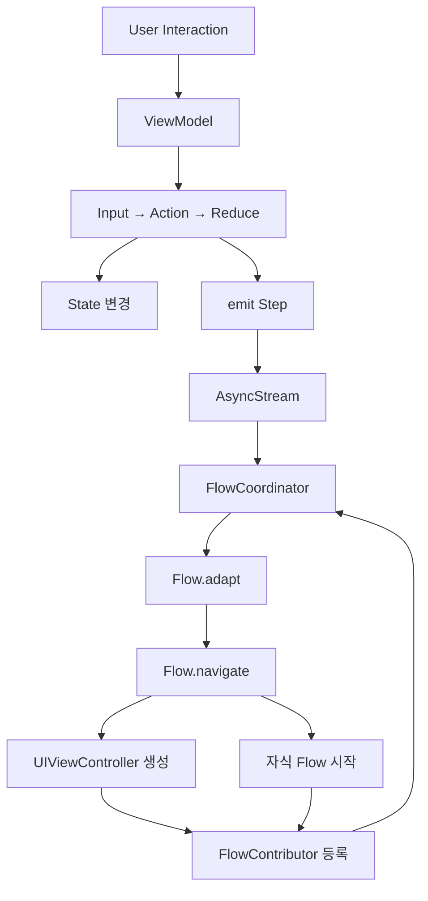

# AsyncFlow 아키텍처

Swift Concurrency 기반 네비게이션 프레임워크

## 설계 원칙

AsyncFlow는 다음 원칙에 따라 설계되었습니다:

1. **의존성 제거**: RxSwift 없이 Swift Concurrency만 사용
2. **타입 안전성**: 강력한 타입 시스템으로 컴파일 타임 안전성 보장
3. **테스트 가능성**: 모든 컴포넌트가 쉽게 테스트 가능
4. **AsyncViewModel 통합**: 단방향 데이터 흐름과 자연스러운 통합
5. **선언적 네비게이션**: Flow에서 Step → 네비게이션 매핑을 명확하게 표현

---

## 핵심 개념

### 계층 구조

```
┌─────────────────────────────────────────────────────────────┐
│                   Application Layer                          │
│  ┌───────────────────────────────────────────────────────┐  │
│  │  • Step 정의 (enum)                                    │  │
│  │  • Flow 구현 (네비게이션 로직)                         │  │
│  │  • ViewModel (Stepper 역할)                            │  │
│  │  • UIViewController                                    │  │
│  └───────────────────────────────────────────────────────┘  │
└──────────────────────────────┬───────────────────────────────┘
                               │ depends on
                               ▼
┌─────────────────────────────────────────────────────────────┐
│                    AsyncFlow Core                            │
│  ┌───────────────────────────────────────────────────────┐  │
│  │  • Step 프로토콜                                        │  │
│  │  • Stepper 프로토콜                                     │  │
│  │  • Presentable 프로토콜                                 │  │
│  │  • Flow 프로토콜                                        │  │
│  │  • FlowCoordinator                                     │  │
│  └───────────────────────────────────────────────────────┘  │
└─────────────────────────────────────────────────────────────┘
```

---

## 6가지 핵심 타입

### 1. Step

네비게이션 의도를 표현하는 프로토콜. 상태 변화나 사용자 액션을 나타냅니다.

```swift
public protocol Step: Sendable {}
```

**사용 예시:**

```swift
enum MovieStep: Step {
    case movieList
    case movieDetail(id: Int)
    case castDetail(id: Int)
    case unauthorized
}
```

**원칙:**
- Step은 네비게이션 독립적이어야 함
- ❌ `showMovieDetail(id: Int)` - 화면 표시를 강제
- ✅ `movieDetail(id: Int)` - 의도만 표현, Flow가 결정

---

### 2. Stepper

Step을 방출하는 주체 (주로 ViewModel).

```swift
@MainActor
public protocol Stepper: AnyObject {
    associatedtype StepType: Step
    var steps: AsyncStream<StepType> { get }
}
```

**사용 예시:**

```swift
@AsyncViewModel
final class MovieListViewModel: StepEmittable {
    typealias StepType = MovieStep
    var stepContinuation: AsyncStream<MovieStep>.Continuation?
    
    // AsyncViewModel 표준 구조
    enum Input { case movieTapped(id: Int) }
    enum Action: Equatable { case selectMovie(id: Int) }
    struct State: Equatable { var movies: [Movie] = [] }
    enum CancelID: Hashable { case load }
    
    func reduce(state: inout State, action: Action) -> [AsyncEffect<Action, CancelID>] {
        switch action {
        case .selectMovie(let id):
            // State 변경 없이 Step만 방출
            emit(.movieDetail(id: id))  // ← 네비게이션!
            return []
        }
    }
}
```

---

### 3. Presentable

화면에 표시될 수 있는 것을 추상화.

```swift
@MainActor
public protocol Presentable: AnyObject {
    var viewController: UIViewController { get }
    var isPresented: Bool { get }
    var onDismissed: AsyncStream<Void> { get }
    var allowStepWhenDismissed: Bool { get }
}
```

**구현체:**
- `UIViewController` (extension으로 자동 구현)
- `Flow` (하위 Flow를 표시할 때)

---

### 4. Flow

네비게이션 영역을 정의하고, Step을 네비게이션 액션으로 변환.

```swift
@MainActor
public protocol Flow: Presentable {
    associatedtype StepType: Step
    
    var root: any Presentable { get }
    
    /// Step을 네비게이션 액션으로 변환
    func navigate(to step: StepType) async -> FlowContributors
    
    /// Step 필터링/변환 (권한 체크 등)
    func adapt(step: StepType) async -> StepType?
}
```

**사용 예시:**

```swift
final class MovieFlow: Flow {
    typealias StepType = MovieStep
    
    var root: any Presentable { navigationController }
    private let navigationController = UINavigationController()
    private let services: AppServices
    
    init(services: AppServices) {
        self.services = services
    }
    
    func navigate(to step: MovieStep) async -> FlowContributors {
        switch step {
        case .movieList:
            return navigateToMovieList()
        case .movieDetail(let id):
            return navigateToMovieDetail(id: id)
        case .castDetail(let id):
            return navigateToCastDetail(id: id)
        case .unauthorized:
            return showUnauthorizedAlert()
        }
    }
    
    func adapt(step: MovieStep) async -> MovieStep? {
        // 권한 체크 예시
        switch step {
        case .movieDetail:
            return await PermissionManager.isAuthorized() ? step : .unauthorized
        default:
            return step
        }
    }
    
    private func navigateToMovieList() -> FlowContributors {
        let viewModel = MovieListViewModel()
        let viewController = MovieListViewController(viewModel: viewModel)
        navigationController.pushViewController(viewController, animated: true)
        
        // viewController가 Presentable, viewModel이 Stepper
        return .one(.contribute(presentable: viewController, stepper: viewModel))
    }
}
```

---

### 5. FlowContributor

다음 Stepper와 Presentable을 연결.

```swift
public enum FlowContributor: Sendable {
    case contribute(presentable: any Presentable, stepper: any Stepper)
    case forwardToParent(step: any Step)
    case end
}

public enum FlowContributors: Sendable {
    case none
    case one(FlowContributor)
    case multiple([FlowContributor])
}
```

**의미:**
- `.contribute(presentable, stepper)`: 이 화면이 새로운 Step을 방출할 수 있음
- `.forwardToParent(step)`: 부모 Flow에게 Step 전달
- `.end`: 이 Flow 종료
- `.none`: 더 이상 네비게이션 없음

---

### 6. FlowCoordinator

전체 네비게이션 조율자. 앱에 단 하나만 존재.

```swift
@MainActor
public final class FlowCoordinator {
    public var willNavigate: AsyncStream<(any Flow, any Step)>
    public var didNavigate: AsyncStream<(any Flow, any Step)>
    
    public func coordinate<F: Flow>(
        flow: F,
        with stepper: some Stepper
    )
    
    public func navigate(to step: some Step) async
}
```

**사용 예시 (AppDelegate):**

```swift
class AppDelegate: UIResponder, UIApplicationDelegate {
    var window: UIWindow?
    let coordinator = FlowCoordinator()
    
    func application(
        _ application: UIApplication,
        didFinishLaunchingWithOptions launchOptions: [UIApplication.LaunchOptionsKey: Any]?
    ) -> Bool {
        guard let window = window else { return false }
        
        // 네비게이션 이벤트 로깅
        Task {
            for await (flow, step) in coordinator.didNavigate {
                print("✅ \(type(of: flow)) → \(step)")
            }
        }
        
        // 앱 Flow 시작
        let appFlow = AppFlow(window: window)
        let appStepper = OneStepper(AppStep.launch)
        coordinator.coordinate(flow: appFlow, with: appStepper)
        
        return true
    }
}
```

---

## 데이터 흐름



**단계별 설명:**

1. 사용자가 버튼을 탭함
2. ViewModel이 Input을 받아 Action으로 변환
3. Reduce에서 State 변경 및 Step 방출
4. FlowCoordinator가 AsyncStream을 통해 Step 수신
5. Flow.adapt()로 Step 필터링/변환
6. Flow.navigate()로 네비게이션 실행
7. FlowContributor를 통해 새로운 Stepper 등록
8. 새 Stepper의 Step을 FlowCoordinator가 계속 감지

---

## AsyncViewModel 통합

AsyncFlow는 AsyncViewModel과 자연스럽게 통합됩니다.

### StepEmittable 프로토콜

```swift
public protocol StepEmittable: AnyObject {
    associatedtype StepType: Step
    var stepContinuation: AsyncStream<StepType>.Continuation? { get set }
    var steps: AsyncStream<StepType> { get }
    
    func emit(_ step: StepType)
}
```

### 통합 예시

```swift
@AsyncViewModel
final class LoginViewModel: StepEmittable {
    typealias StepType = AuthStep
    var stepContinuation: AsyncStream<AuthStep>.Continuation?
    
    enum Input {
        case loginButtonTapped
        case signupButtonTapped
    }
    
    enum Action: Equatable {
        case login(email: String, password: String)
        case navigateToSignup
    }
    
    struct State: Equatable {
        var email: String = ""
        var password: String = ""
        var isLoading: Bool = false
    }
    
    enum CancelID: Hashable {
        case login
    }
    
    func reduce(state: inout State, action: Action) -> [AsyncEffect<Action, CancelID>] {
        switch action {
        case .login(let email, let password):
            state.isLoading = true
            return [
                .run(id: .login) {
                    try await authService.login(email, password)
                    return .loginSuccess
                }
            ]
        case .navigateToSignup:
            // State 변경 없이 네비게이션만
            emit(.signup)  // ← Step 방출!
            return []
        case .loginSuccess:
            state.isLoading = false
            emit(.loginCompleted)  // ← Step 방출!
            return []
        }
    }
}
```

**장점:**
- ViewModel은 비즈니스 로직에만 집중
- 네비게이션 결정은 Flow에 위임
- State 변경과 네비게이션이 명확히 분리
- 테스트 시 Step 방출만 검증

---

## 고급 사용법

### 1. 자식 Flow 시작

TabBar나 Modal Flow를 시작하는 경우:

```swift
func navigate(to step: DashboardStep) async -> FlowContributors {
    switch step {
    case .dashboard:
        return navigateToDashboard()
    }
}

private func navigateToDashboard() -> FlowContributors {
    let movieFlow = MovieFlow()
    let watchedFlow = WatchedFlow()
    
    let tabBarController = UITabBarController()
    tabBarController.viewControllers = [
        movieFlow.root.viewController,
        watchedFlow.root.viewController
    ]
    
    window.rootViewController = tabBarController
    
    // 여러 Flow를 동시에 등록
    return .multiple([
        .contribute(presentable: movieFlow, stepper: OneStepper(.movieList)),
        .contribute(presentable: watchedFlow, stepper: OneStepper(.watchedList))
    ])
}
```

### 2. Deep Link 처리

```swift
// AppDelegate나 SceneDelegate에서
func userNotificationCenter(
    _ center: UNUserNotificationCenter,
    didReceive response: UNNotificationResponse,
    withCompletionHandler completionHandler: @escaping () -> Void
) {
    Task {
        // 모든 활성 Flow에 Step 전달
        await coordinator.navigate(to: MovieStep.movieDetail(id: 12345))
    }
    completionHandler()
}
```

### 3. 권한 기반 네비게이션

```swift
func adapt(step: MovieStep) async -> MovieStep? {
    switch step {
    case .movieDetail:
        // 비동기 권한 체크
        let isAuthorized = await PermissionManager.checkAuthorization()
        return isAuthorized ? step : .unauthorized
        
    case .premium:
        // 인앱 구매 확인
        let isPremium = await PurchaseManager.isPremiumUser()
        return isPremium ? step : .purchaseRequired
        
    default:
        return step
    }
}
```

---

## 테스트

### Flow 테스트

```swift
@Test
func testMovieFlowNavigation() async {
    let store = FlowTestStore(flow: MovieFlow())
    
    // Step 전달 및 검증
    let contributors = await store.navigate(to: .movieList)
    
    #expect(store.steps == [.movieList])
    
    if case .one(.contribute(_, let stepper)) = contributors {
        // Stepper가 올바르게 등록되었는지 확인
        #expect(stepper is MovieListViewModel)
    }
}
```

### ViewModel + Step 테스트

```swift
@Test
func testViewModelEmitsStep() async {
    let viewModel = MovieListViewModel()
    let mockStepper = MockStepper<MovieStep>()
    
    var receivedSteps: [MovieStep] = []
    Task {
        for await step in viewModel.steps {
            receivedSteps.append(step)
        }
    }
    
    viewModel.send(.movieTapped(id: 1))
    
    try await Task.sleep(for: .milliseconds(100))
    #expect(receivedSteps == [.movieDetail(id: 1)])
}
```

---

## RxFlow와의 비교

| 개념 | RxFlow | AsyncFlow |
|------|--------|-----------|
| Step 스트림 | `PublishRelay<Step>` | `AsyncStream<Step>` |
| 비동기 처리 | RxSwift Observable | Swift Concurrency (async/await) |
| 스레드 안전성 | subscribeOn/observeOn | @MainActor |
| 테스트 | RxTest | FlowTestStore |
| 외부 의존성 | RxSwift, RxRelay | 없음 (Swift 표준) |
| 메모리 관리 | DisposeBag | Task 자동 취소 |

---

## 모듈 구조

```
AsyncFlow/
├── Sources/
│   ├── Core/
│   │   ├── Step.swift                     # Step 프로토콜
│   │   ├── Stepper.swift                  # Stepper 프로토콜
│   │   ├── Presentable.swift              # Presentable 프로토콜
│   │   ├── Flow.swift                     # Flow 프로토콜
│   │   ├── FlowContributor.swift          # FlowContributor enum
│   │   └── FlowCoordinator.swift          # 전역 조율자
│   ├── Integration/
│   │   ├── StepEmittable.swift            # AsyncViewModel 통합
│   │   └── UIViewController+Presentable.swift
│   ├── Utilities/
│   │   ├── AsyncStreamBridge.swift        # 브로드캐스트 스트림
│   │   ├── OneStepper.swift               # 초기 Step 발행
│   │   └── CompositeStepper.swift         # Stepper 조합
│   └── Testing/
│       ├── FlowTestStore.swift            # Flow 테스트 스토어
│       └── MockStepper.swift              # Mock Stepper
└── Tests/
    └── AsyncFlowTests/
```

---

## 요약

AsyncFlow는:
- ✅ RxSwift 없이 Swift Concurrency만 사용
- ✅ AsyncViewModel과 자연스러운 통합
- ✅ 선언적이고 테스트 가능한 네비게이션
- ✅ 타입 안전성 보장
- ✅ Deep Link, 권한 체크 등 고급 기능 지원

