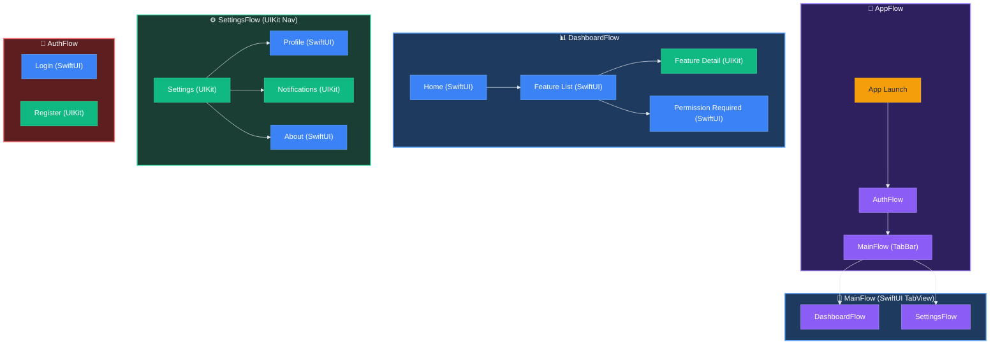

# AsyncFlowExample 앱 설계 문서

## 개요

AsyncFlow의 모든 핵심 기능을 데모하는 실전 예제 앱입니다.

### 데모 대상 기능

| AsyncFlow 기능 | 데모 시나리오 |
|--------------|-------------|
| **Step** | 모든 네비게이션 의도를 Step enum으로 정의 |
| **Stepper** | ViewModel이 Step 방출 (AsyncViewModel 통합) |
| **Flow** | 각 영역별 Flow 정의 (AppFlow, DashboardFlow, SettingsFlow, AuthFlow) |
| **FlowCoordinator** | AppDelegate에서 전체 조율 |
| **OneStepper** | 초기 Step 방출 (앱 시작, Flow 진입) |
| **CompositeStepper** | TabBar에서 여러 Tab의 Stepper 조합 |
| **adapt(step:)** | 권한 체크, 로그인 필터링 |
| **willNavigate/didNavigate** | 네비게이션 로깅 및 분석 |
| **FlowContributors** | .none, .one, .multiple 모두 사용 |
| **SwiftUI ↔ UIKit** | 혼합 화면 구성 |
| **Deep Link** | URL Scheme 처리 |

---

## 앱 구조

### 화면 플로우 다이어그램



---

## 프로젝트 구조

```
AsyncFlowExample/
├── Sources/
│   ├── App/
│   │   └── AppDelegate.swift                    # FlowCoordinator 초기화
│   │
│   ├── Models/                                  # 도메인 모델
│   │   ├── Feature.swift
│   │   ├── User.swift
│   │   └── DeepLink.swift
│   │
│   ├── Steps/                                   # 네비게이션 Step
│   │   ├── AppStep.swift
│   │   ├── DashboardStep.swift
│   │   ├── SettingsStep.swift
│   │   └── AuthStep.swift
│   │
│   ├── Flows/                                   # Flow 정의
│   │   ├── AppFlow.swift                        # 앱 전체 Flow
│   │   ├── MainFlow.swift                       # TabBar Flow
│   │   ├── DashboardFlow.swift                  # Dashboard 영역
│   │   ├── SettingsFlow.swift                   # Settings 영역
│   │   └── AuthFlow.swift                       # 인증 영역
│   │
│   ├── ViewModels/                              # AsyncViewModel
│   │   ├── Dashboard/
│   │   │   ├── DashboardHomeViewModel.swift    (SwiftUI)
│   │   │   ├── FeatureListViewModel.swift      (SwiftUI)
│   │   │   └── FeatureDetailViewModel.swift    (UIKit)
│   │   ├── Settings/
│   │   │   ├── SettingsViewModel.swift         (UIKit)
│   │   │   ├── ProfileViewModel.swift          (SwiftUI)
│   │   │   ├── NotificationsViewModel.swift    (UIKit)
│   │   │   └── AboutViewModel.swift            (SwiftUI)
│   │   └── Auth/
│   │       ├── LoginViewModel.swift            (SwiftUI)
│   │       └── RegisterViewModel.swift         (UIKit)
│   │
│   ├── Views/
│   │   ├── SwiftUI/                             # SwiftUI View
│   │   │   ├── MainTabView.swift                (TabBar)
│   │   │   ├── DashboardHomeView.swift
│   │   │   ├── FeatureListView.swift
│   │   │   ├── PermissionRequiredView.swift
│   │   │   ├── ProfileView.swift
│   │   │   ├── AboutView.swift
│   │   │   └── LoginView.swift
│   │   │
│   │   └── UIKit/                               # UIKit ViewController
│   │       ├── FeatureDetailViewController.swift
│   │       ├── SettingsViewController.swift
│   │       ├── NotificationsViewController.swift
│   │       └── RegisterViewController.swift
│   │
│   ├── Services/                                # 비즈니스 로직
│   │   ├── AuthService.swift
│   │   ├── PermissionService.swift
│   │   ├── DeepLinkService.swift
│   │   └── AnalyticsService.swift
│   │
│   └── Utilities/
│       └── SwiftUIHosting.swift                 # SwiftUI ↔ UIKit 통합
│
└── Resources/
    └── LaunchScreen.storyboard
```

---

## Step 정의

### AppStep.swift

```swift
enum AppStep: Step {
    // 앱 라이프사이클
    case launch
    case onboarding
    case main
    
    // Deep Link
    case deepLink(URL)
    
    // Auth 관련
    case loginRequired
    case logout
    
    // Flow 전환
    case dashboardRequired(DashboardStep)
    case settingsRequired(SettingsStep)
    case authRequired(AuthStep)
}
```

### DashboardStep.swift

```swift
enum DashboardStep: Step {
    // Dashboard 영역
    case home
    case featureList
    case featureDetail(Feature)
    case permissionRequired(message: String)
    
    // Navigation
    case back
    case dismiss
}
```

### SettingsStep.swift

```swift
enum SettingsStep: Step {
    // Settings 영역
    case settings
    case profile
    case notifications
    case about
    
    // Actions
    case logout
    case back
}
```

### AuthStep.swift

```swift
enum AuthStep: Step {
    // Auth Flow
    case login
    case register
    case forgotPassword
    
    // Result
    case loginSuccess
    case loginCancelled
}
```

---

## AsyncViewModel 패턴

모든 ViewModel은 AsyncViewModel을 사용하며 Stepper를 채택합니다.

### 예시: DashboardHomeViewModel.swift

```swift
import AsyncViewModel
import AsyncFlow

@AsyncViewModel
final class DashboardHomeViewModel: ObservableObject, Stepper {
    typealias StepType = DashboardStep
    
    // MARK: - Types
    
    enum Input: Equatable, Sendable {
        case onAppear
        case featureListTapped
        case permissionFeatureTapped
    }
    
    enum Action: Equatable, Sendable {
        case loadFeatures
        case featuresLoaded([Feature])
        case navigateToFeatureList
        case navigateToPermissionRequired
    }
    
    struct State: Equatable, Sendable {
        var features: [Feature] = []
        var isLoading: Bool = false
    }
    
    enum CancelID: Hashable, Sendable {
        case loadFeatures
    }
    
    // MARK: - Properties
    
    @Published var state = State()
    
    // MARK: - Transform
    
    func transform(_ input: Input) -> [Action] {
        switch input {
        case .onAppear:
            return [.loadFeatures]
        case .featureListTapped:
            return [.navigateToFeatureList]
        case .permissionFeatureTapped:
            return [.navigateToPermissionRequired]
        }
    }
    
    // MARK: - Reduce
    
    func reduce(state: inout State, action: Action) -> [AsyncEffect<Action, CancelID>] {
        switch action {
        case .loadFeatures:
            state.isLoading = true
            return [
                .run(id: .loadFeatures) {
                    try await Task.sleep(nanoseconds: 500_000_000)
                    return .featuresLoaded(Feature.mockFeatures)
                }
            ]
            
        case let .featuresLoaded(features):
            state.isLoading = false
            state.features = features
            return [.none]
            
        case .navigateToFeatureList:
            emit(.featureList)
            return [.none]
            
        case .navigateToPermissionRequired:
            emit(.permissionRequired(message: "카메라 권한이 필요합니다"))
            return [.none]
        }
    }
}
```

---

## Flow 구현

### DashboardFlow.swift

```swift
import AsyncFlow
import UIKit

@MainActor
final class DashboardFlow: Flow {
    typealias StepType = DashboardStep
    
    var root: any Presentable { navigationController }
    private let navigationController = UINavigationController()
    private let services: AppServices
    
    init(services: AppServices) {
        self.services = services
    }
    
    // MARK: - Step Adaptation (권한 체크)
    
    func adapt(step: DashboardStep) async -> DashboardStep? {
        switch step {
        case .featureDetail(let feature) where feature.requiresPermission:
            // 권한 체크
            let hasPermission = await services.permissionService.checkPermission(.camera)
            if !hasPermission {
                return .permissionRequired(message: "카메라 권한이 필요합니다")
            }
            return step
        default:
            return step
        }
    }
    
    // MARK: - Navigation
    
    func navigate(to step: DashboardStep) async -> FlowContributors<DashboardStep> {
        switch step {
        case .home:
            return navigateToHome()
            
        case .featureList:
            return navigateToFeatureList()
            
        case let .featureDetail(feature):
            return navigateToFeatureDetail(feature)
            
        case let .permissionRequired(message):
            return navigateToPermissionRequired(message)
            
        case .back:
            navigationController.popViewController(animated: true)
            return .none
            
        case .dismiss:
            navigationController.dismiss(animated: true)
            return .none
        }
    }
    
    // MARK: - Private
    
    private func navigateToHome() -> FlowContributors<DashboardStep> {
        let viewModel = DashboardHomeViewModel()
        let view = DashboardHomeView(viewModel: viewModel)
        let viewController = UIHostingController(rootView: view)
        viewController.title = "Dashboard"
        
        navigationController.setViewControllers([viewController], animated: false)
        
        return .one(.contribute(presentable: viewController, stepper: viewModel))
    }
    
    private func navigateToFeatureList() -> FlowContributors<DashboardStep> {
        let viewModel = FeatureListViewModel()
        let view = FeatureListView(viewModel: viewModel)
        let viewController = UIHostingController(rootView: view)
        viewController.title = "Features"
        
        navigationController.pushViewController(viewController, animated: true)
        
        return .one(.contribute(presentable: viewController, stepper: viewModel))
    }
    
    private func navigateToFeatureDetail(_ feature: Feature) -> FlowContributors<DashboardStep> {
        let viewModel = FeatureDetailViewModel(feature: feature)
        let viewController = FeatureDetailViewController(viewModel: viewModel)
        
        navigationController.pushViewController(viewController, animated: true)
        
        return .one(.contribute(presentable: viewController, stepper: viewModel))
    }
    
    private func navigateToPermissionRequired(_ message: String) -> FlowContributors<DashboardStep> {
        let view = PermissionRequiredView(message: message) { [weak self] in
            self?.emit(.back)
        }
        let viewController = UIHostingController(rootView: view)
        
        navigationController.pushViewController(viewController, animated: true)
        
        return .none
    }
}
```

---

## MainFlow (TabBar with CompositeStepper)

### MainFlow.swift

```swift
import AsyncFlow
import SwiftUI
import UIKit

@MainActor
final class MainFlow: Flow {
    typealias StepType = AppStep
    
    var root: any Presentable { tabBarController }
    private let tabBarController = UITabBarController()
    private let services: AppServices
    
    private var dashboardFlow: DashboardFlow?
    private var settingsFlow: SettingsFlow?
    
    init(services: AppServices) {
        self.services = services
    }
    
    func navigate(to step: AppStep) async -> FlowContributors<AppStep> {
        switch step {
        case .main:
            return navigateToMain()
        default:
            return .none
        }
    }
    
    private func navigateToMain() -> FlowContributors<AppStep> {
        // Dashboard Flow
        let dashboardFlow = DashboardFlow(services: services)
        let dashboardStepper = OneStepper(DashboardStep.home)
        dashboardFlow.root.viewController.tabBarItem = UITabBarItem(
            title: "Dashboard",
            image: UIImage(systemName: "chart.bar"),
            tag: 0
        )
        
        // Settings Flow
        let settingsFlow = SettingsFlow(services: services)
        let settingsStepper = OneStepper(SettingsStep.settings)
        settingsFlow.root.viewController.tabBarItem = UITabBarItem(
            title: "Settings",
            image: UIImage(systemName: "gear"),
            tag: 1
        )
        
        self.dashboardFlow = dashboardFlow
        self.settingsFlow = settingsFlow
        
        tabBarController.viewControllers = [
            dashboardFlow.root.viewController,
            settingsFlow.root.viewController
        ]
        
        // CompositeStepper로 두 Flow의 Step 병합
        let compositeStepper = CompositeStepper([
            dashboardStepper.asAnyStep(),
            settingsStepper.asAnyStep()
        ])
        
        return .multiple([
            .contribute(presentable: dashboardFlow, stepper: dashboardStepper),
            .contribute(presentable: settingsFlow, stepper: settingsStepper)
        ])
    }
}
```

---

## Deep Link 처리

### AppFlow.swift

```swift
@MainActor
final class AppFlow: Flow {
    typealias StepType = AppStep
    
    var root: any Presentable { window }
    
    private let window: UIWindow
    private let services: AppServices
    private var mainFlow: MainFlow?
    
    init(window: UIWindow, services: AppServices) {
        self.window = window
        self.services = services
    }
    
    func navigate(to step: AppStep) async -> FlowContributors<AppStep> {
        switch step {
        case .launch:
            return navigateToLaunch()
            
        case .main:
            return navigateToMain()
            
        case .deepLink(let url):
            return navigateToDeepLink(url)
            
        case .loginRequired:
            return navigateToAuth()
            
        default:
            return .none
        }
    }
    
    private func navigateToDeepLink(_ url: URL) -> FlowContributors<AppStep> {
        // URL 파싱
        guard let components = URLComponents(url: url, resolvingAgainstBaseURL: false) else {
            return .none
        }
        
        switch components.path {
        case "/dashboard":
            return .one(.contribute(
                presentable: self,
                stepper: OneStepper(.main)
            ))
            
        case "/settings/profile":
            // Settings Tab으로 이동 후 Profile 화면 표시
            return .one(.contribute(
                presentable: self,
                stepper: OneStepper(.settingsRequired(.profile))
            ))
            
        default:
            return .none
        }
    }
}
```

---

## 네비게이션 로깅 (willNavigate/didNavigate)

### AppDelegate.swift

```swift
@main
class AppDelegate: UIResponder, UIApplicationDelegate {
    var window: UIWindow?
    let coordinator = FlowCoordinator()
    let analyticsService = AnalyticsService()
    
    func application(
        _ application: UIApplication,
        didFinishLaunchingWithOptions launchOptions: [UIApplication.LaunchOptionsKey: Any]?
    ) -> Bool {
        window = UIWindow(frame: UIScreen.main.bounds)
        
        let services = AppServices(
            authService: AuthService(),
            permissionService: PermissionService(),
            deepLinkService: DeepLinkService(),
            analyticsService: analyticsService
        )
        
        let appFlow = AppFlow(window: window!, services: services)
        let appStepper = OneStepper(AppStep.launch)
        
        // 네비게이션 이벤트 모니터링
        Task {
            for await event in coordinator.willNavigate {
                print("🚀 Will Navigate: \(event.flowType) -> \(event.stepDescription)")
                analyticsService.trackNavigation(event)
            }
        }
        
        Task {
            for await event in coordinator.didNavigate {
                print("✅ Did Navigate: \(event.flowType) -> \(event.stepDescription)")
            }
        }
        
        coordinator.coordinate(flow: appFlow, with: appStepper)
        
        return true
    }
}
```

---

## 기능 데모 체크리스트

### AsyncFlow 핵심 기능

- [ ] **Step**: 모든 네비게이션 의도를 Step enum으로 정의
- [ ] **Stepper**: ViewModel이 Stepper 채택, emit() 사용
- [ ] **Flow**: 4개 Flow 구현 (AppFlow, MainFlow, DashboardFlow, SettingsFlow, AuthFlow)
- [ ] **FlowCoordinator**: AppDelegate에서 coordinate() 호출
- [ ] **OneStepper**: 초기 Step 방출 (launch, main, home 등)
- [ ] **CompositeStepper**: TabBar에서 여러 Tab Stepper 조합
- [ ] **adapt(step:)**: DashboardFlow에서 권한 체크
- [ ] **willNavigate/didNavigate**: 네비게이션 로깅
- [ ] **FlowContributors**: .none, .one, .multiple 모두 사용

### AsyncViewModel 통합

- [ ] **@AsyncViewModel**: 모든 ViewModel에 매크로 적용
- [ ] **Input/Action/State**: 명확한 타입 정의
- [ ] **transform()**: Input → Action 변환
- [ ] **reduce()**: State 변경 + AsyncEffect 반환
- [ ] **AsyncEffect**: .run, .cancel, .debounce 등 사용
- [ ] **emit()**: Step 방출로 네비게이션

### UI 혼합

- [ ] **SwiftUI View**: Dashboard, Features, Login, Profile, About (5개)
- [ ] **UIKit ViewController**: Settings, Notifications, Register, FeatureDetail (4개)
- [ ] **UIHostingController**: SwiftUI ↔ UIKit 브릿징

### 고급 기능

- [ ] **Deep Link**: URL Scheme 처리
- [ ] **권한 체크**: adapt()로 필터링
- [ ] **생명주기 관리**: onDismissed 스트림
- [ ] **Analytics**: 네비게이션 이벤트 추적

---

**Created by 정준영 on 2025. 12. 29.**

