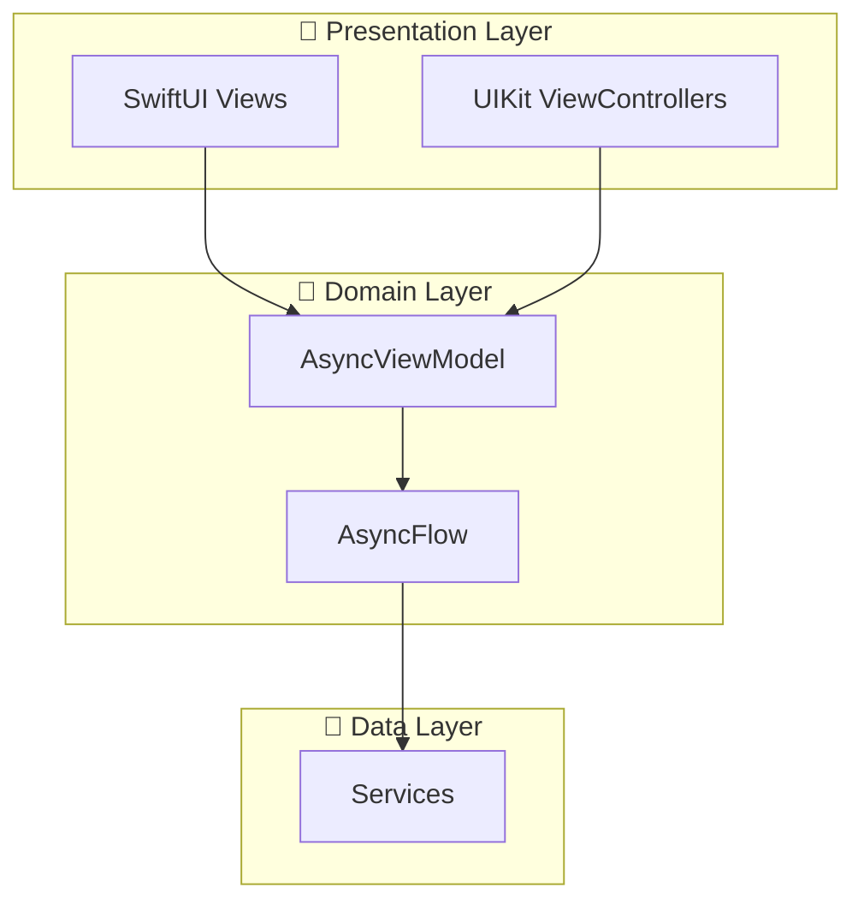

# AsyncFlowExample

AsyncFlow 프레임워크의 모든 기능을 데모하는 실전 예제 앱

## 🎯 개요

이 프로젝트는 **AsyncFlow**와 **AsyncViewModel**을 함께 사용하여 SwiftUI와 UIKit을 혼합한 네비게이션 앱을 구현한 종합 데모입니다.

### 주요 구현 내용

- ✅ **AsyncFlow** 모든 핵심 기능 데모
- ✅ **AsyncViewModel** 단방향 데이터 흐름
- ✅ **SwiftUI + UIKit** 하이브리드 UI
- ✅ **MVVM 패턴** 체계적인 아키텍처
- ✅ **Swift 6 Concurrency** async/await, Actor
- ✅ **Tuist** 프로젝트 관리

---

## 📱 앱 구조

### 화면 플로우

```
App Launch
    ↓
AuthFlow (로그인 필요 시)
    ├─ Login (SwiftUI)
    └─ Register (UIKit)
    ↓
MainFlow (TabBar)
    ├─ Dashboard Tab
    │   ├─ Home (SwiftUI)
    │   ├─ Feature List (SwiftUI)
    │   ├─ Feature Detail (UIKit) ← adapt() 권한 체크
    │   └─ Permission Required (SwiftUI)
    │
    └─ Settings Tab
        ├─ Settings (UIKit)
        ├─ Profile (SwiftUI)
        ├─ Notifications (UIKit)
        └─ About (SwiftUI)
```

---

## 🔥 AsyncFlow 기능 데모

### 1. Step (네비게이션 의도)

```swift
enum DashboardStep: Step {
    case home
    case featureList
    case featureDetail(Feature)
    case permissionRequired(message: String)
    case back
    case dismiss
}
```

### 2. Stepper (Step 방출)

```swift
@AsyncViewModel
final class DashboardHomeViewModel: ObservableObject, Stepper {
    typealias StepType = DashboardStep
    
    func reduce(state: inout State, action: Action) -> [AsyncEffect<Action, CancelID>] {
        switch action {
        case .navigateToFeatureList:
            emit(.featureList)  // ← Step 방출!
            return [.none]
        }
    }
}
```

### 3. Flow (Step → 네비게이션 변환)

```swift
final class DashboardFlow: Flow {
    func navigate(to step: DashboardStep) async -> FlowContributors<DashboardStep> {
        switch step {
        case .featureList:
            return navigateToFeatureList()
        case let .featureDetail(feature):
            return navigateToFeatureDetail(feature)
        }
    }
}
```

### 4. FlowCoordinator (전체 조율)

```swift
// AppDelegate.swift
let coordinator = FlowCoordinator()
let appFlow = AppFlow(window: window!, services: services, coordinator: coordinator)
coordinator.coordinate(flow: appFlow, with: OneStepper(AppStep.launch))
```

### 5. OneStepper (초기 Step 방출)

```swift
// 앱 시작 시
let appStepper = OneStepper(AppStep.launch)

// Flow 진입 시
coordinator.coordinate(
    flow: dashboardFlow,
    with: OneStepper(DashboardStep.home)
)
```

### 6. adapt(step:) (권한 체크)

```swift
func adapt(step: DashboardStep) async -> DashboardStep? {
    switch step {
    case .featureDetail(let feature) where feature.requiresPermission:
        let hasPermission = await services.permissionService.checkPermission(.camera)
        if !hasPermission {
            return .permissionRequired(message: "카메라 권한이 필요합니다")
        }
        return step
    default:
        return step
    }
}
```

### 7. willNavigate/didNavigate (이벤트 모니터링)

```swift
Task {
    for await event in coordinator.willNavigate {
        print("🚀 Will Navigate: \(event.flowType) -> \(event.stepDescription)")
        analyticsService.trackNavigation(event)
    }
}
```

### 8. Deep Link 처리

```swift
func navigateToDeepLink(_ url: URL) -> FlowContributors<AppStep> {
    guard let deepLink = services.deepLinkService.parseDeepLink(url) else {
        return .none
    }
    
    switch deepLink {
    case .settingsProfile:
        return .one(.contribute(
            presentable: self,
            stepper: OneStepper(.settingsRequired(.profile))
        ))
    }
}
```

---

## 📂 프로젝트 구조

```
AsyncFlowExample/
├── Sources/
│   ├── App/
│   │   └── AppDelegate.swift              # FlowCoordinator 초기화
│   │
│   ├── Models/
│   │   ├── Feature.swift                  # 기능 모델
│   │   ├── User.swift                     # 사용자 모델
│   │   └── AppServices.swift              # 서비스 컨테이너
│   │
│   ├── Steps/
│   │   ├── AppStep.swift                  # 앱 전체 Step
│   │   ├── DashboardStep.swift            # Dashboard Step
│   │   ├── SettingsStep.swift             # Settings Step
│   │   └── AuthStep.swift                 # Auth Step
│   │
│   ├── Flows/
│   │   ├── AppFlow.swift                  # 앱 전체 Flow
│   │   ├── MainFlow.swift                 # TabBar Flow
│   │   ├── DashboardFlow.swift            # Dashboard Flow
│   │   ├── SettingsFlow.swift             # Settings Flow
│   │   └── AuthFlow.swift                 # Auth Flow
│   │
│   ├── ViewModels/
│   │   ├── Dashboard/
│   │   │   ├── DashboardHomeViewModel.swift
│   │   │   ├── FeatureListViewModel.swift
│   │   │   └── FeatureDetailViewModel.swift
│   │   ├── Settings/
│   │   │   ├── SettingsViewModel.swift
│   │   │   ├── ProfileViewModel.swift
│   │   │   ├── NotificationsViewModel.swift
│   │   │   └── AboutViewModel.swift
│   │   └── Auth/
│   │       ├── LoginViewModel.swift
│   │       └── RegisterViewModel.swift
│   │
│   ├── Views/
│   │   ├── SwiftUI/
│   │   │   ├── DashboardHomeView.swift
│   │   │   ├── FeatureListView.swift
│   │   │   ├── PermissionRequiredView.swift
│   │   │   ├── LoginView.swift
│   │   │   ├── ProfileView.swift
│   │   │   └── AboutView.swift
│   │   └── UIKit/
│   │       ├── FeatureDetailViewController.swift
│   │       ├── SettingsViewController.swift
│   │       ├── NotificationsViewController.swift
│   │       └── RegisterViewController.swift
│   │
│   ├── Services/
│   │   ├── AuthService.swift              # 인증 서비스
│   │   ├── PermissionService.swift        # 권한 서비스
│   │   ├── DeepLinkService.swift          # Deep Link 파싱
│   │   └── AnalyticsService.swift         # 분석 서비스
│   │
│   └── Utilities/
│       └── UIWindow+Presentable.swift     # UIWindow 확장
│
└── Resources/
    └── LaunchScreen.storyboard
```

**총 파일 수: 37개**

---

## 🛠 빌드 및 실행

### 1. 요구사항

- iOS 15.0+
- Xcode 16.0+
- Swift 6.0+
- Tuist 4.0+

### 2. Tuist 설치

```bash
curl -Ls https://install.tuist.io | bash
```

### 3. 프로젝트 생성

```bash
cd /Users/jimmy/Documents/GitHub/AsyncFlow
tuist install  # 외부 의존성 설치
tuist generate  # Xcode 프로젝트 생성
```

### 4. Xcode에서 실행

```bash
open AsyncFlow.xcworkspace
```

또는 Tuist로 직접 실행:

```bash
tuist run AsyncFlowExample
```

---

## 🎨 SwiftUI + UIKit 혼합

### SwiftUI Views (6개)

- `DashboardHomeView` - Dashboard 홈 화면
- `FeatureListView` - 기능 목록
- `PermissionRequiredView` - 권한 요청 화면
- `LoginView` - 로그인 화면
- `ProfileView` - 프로필 화면
- `AboutView` - About 화면

### UIKit ViewControllers (4개)

- `FeatureDetailViewController` - 기능 상세 화면
- `SettingsViewController` - 설정 메인 화면
- `NotificationsViewController` - 알림 설정
- `RegisterViewController` - 회원가입 화면

### 혼합 패턴

```swift
// SwiftUI를 UIKit에 임베드
let view = LoginView(viewModel: viewModel)
let viewController = UIHostingController(rootView: view)
navigationController.pushViewController(viewController, animated: true)

// UIKit을 Flow에서 사용
let viewController = SettingsViewController(viewModel: viewModel)
navigationController.setViewControllers([viewController], animated: false)
```

---

## 📖 학습 포인트

### AsyncFlow 패턴

1. **Step**: 네비게이션 의도를 표현 (화면과 독립적)
2. **Stepper**: Step을 방출 (ViewModel이 담당)
3. **Flow**: Step을 네비게이션 액션으로 변환
4. **FlowCoordinator**: 전체 네비게이션 조율

### AsyncViewModel 패턴

1. **Input → Action 변환**: `transform(_:)`
2. **State 변경**: `reduce(state:action:)`
3. **비동기 작업**: `AsyncEffect`
4. **네비게이션**: `emit(_:)`로 Step 방출

### 통합 패턴

```
User Tap
   ↓
ViewModel.send(.featureTapped)
   ↓
transform: Input → Action
   ↓
reduce: Action → State + emit(Step)
   ↓
FlowCoordinator
   ↓
Flow.navigate(to:)
   ↓
Push ViewController
```

---

## 🔗 Deep Link 예시

앱에서 지원하는 Deep Link 스키마:

```
asyncflow://dashboard
asyncflow://settings/profile
asyncflow://settings/notifications
asyncflow://feature?id={UUID}
```

---

## 🧪 테스트

테스트 작성 예시:

```swift
@Test
func testDashboardFlow() async {
    let flow = DashboardFlow(services: mockServices)
    let contributors = await flow.navigate(to: .home)
    
    // FlowContributors 검증
    guard case .one(.contribute(let presentable, let stepper)) = contributors else {
        Issue.record("Expected one contributor")
        return
    }
    
    #expect(presentable.viewController is UIHostingController<DashboardHomeView>)
    #expect(stepper is DashboardHomeViewModel)
}
```

---

## 📊 아키텍처 다이어그램



---

## 📚 의존성

- **AsyncFlow**: 네비게이션 프레임워크 (로컬 패키지)
- **AsyncViewModel**: 단방향 데이터 흐름 (v1.2.0)

```swift
// Tuist/Package.swift
dependencies: [
    .package(url: "https://github.com/Jimmy-Jung/AsyncViewModel", from: "1.2.0")
]
```

---

## 🚀 다음 단계

1. **기능 추가**: 더 많은 데모 화면 추가
2. **테스트 작성**: FlowTestStore, AsyncTestStore 활용
3. **CI/CD 구성**: GitHub Actions + Tuist
4. **성능 최적화**: 이미지 캐싱, 페이지네이션 등

---

## 📖 참고 문서

- [AsyncFlow 아키텍처 가이드](../../ARCHITECTURE.md)
- [AsyncViewModel 문서](https://github.com/Jimmy-Jung/AsyncViewModel)
- [Tuist 가이드](https://docs.tuist.io)
- [설계 문서 (개정판)](DESIGN_REVISED.md)

---

## 🎓 주요 학습 내용

### AsyncFlow 핵심 기능 ✅

- [x] Step 정의 및 사용
- [x] Stepper 프로토콜 구현
- [x] Flow 네비게이션
- [x] FlowCoordinator 조율
- [x] OneStepper 사용
- [x] adapt() 권한 체크
- [x] willNavigate/didNavigate 이벤트
- [x] Deep Link 처리

### AsyncViewModel 통합 ✅

- [x] @AsyncViewModel 매크로
- [x] Input/Action/State 타입
- [x] transform() 구현
- [x] reduce() 구현
- [x] AsyncEffect 사용
- [x] emit() Step 방출

### 하이브리드 UI ✅

- [x] SwiftUI Views (6개)
- [x] UIKit ViewControllers (4개)
- [x] UIHostingController 통합

---

**Created by 정준영 on 2025. 12. 29.**

**Made with ❤️ and ☕ in Seoul, Korea**
