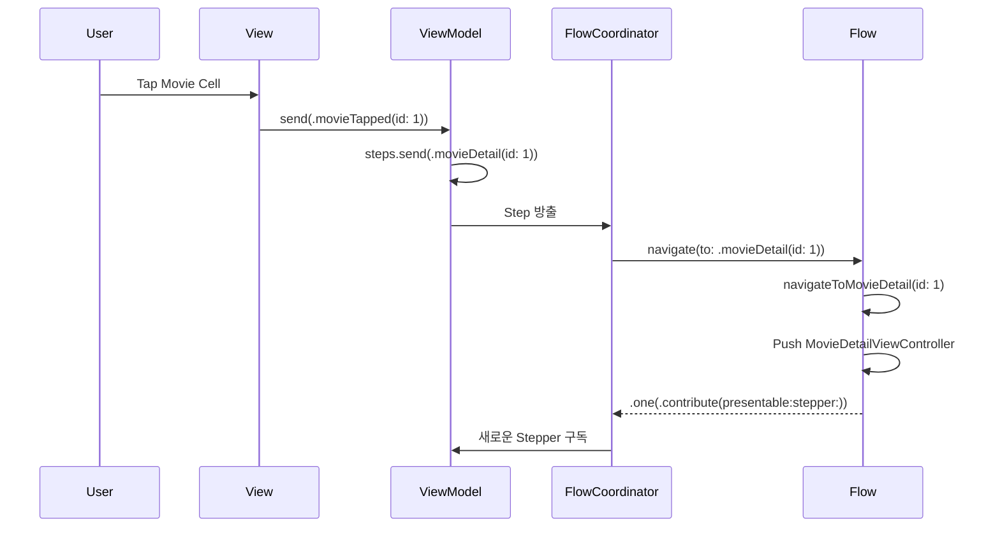

# AsyncFlow

<div align="center">

[](https://swift.org)
[](https://developer.apple.com)
[](LICENSE)
[](https://swift.org/package-manager/)

Swift Concurrency 기반의 선언적 네비게이션 프레임워크

</div>

---

## 개요

AsyncFlow는 [RxFlow](https://github.com/RxSwiftCommunity/RxFlow)에서 영감을 받아 Swift Concurrency로 완전히 재설계한 네비게이션 프레임워크입니다.

복잡한 네비게이션 로직을 선언적으로 관리하고, Flow 기반의 모듈화된 아키텍처를 제공합니다.

### 특징

- ✅ **Swift Concurrency 기반**: async/await와 AsyncStream을 활용한 현대적인 비동기 처리
- ✅ **선언적 네비게이션**: Step을 통한 명확한 의도 표현
- ✅ **모듈화**: Flow 단위로 네비게이션 영역을 분리하여 관리
- ✅ **AsyncViewModel 친화적**: 단방향 데이터 흐름과 자연스럽게 통합
- ✅ **딥링크 지원**: 외부에서 Step을 주입하여 딥링크 처리 가능
- ✅ **테스트 가능**: FlowTestStore를 통한 네비게이션 로직 테스트 지원

### RxFlow와의 차이점

| 특징 | RxFlow | AsyncFlow |
|------|--------|-----------|
| 비동기 처리 | RxSwift Observable | Swift Concurrency (async/await) |
| Step 스트림 | PublishRelay<Step> | AsyncStream<Step> |
| 메모리 관리 | DisposeBag | Task 자동 정리 |
| 플랫폼 지원 | iOS 전용 | iOS 전용 |
| 의존성 | RxSwift, RxCocoa | 없음 (Swift 표준 라이브러리만 사용) |

---

## 목차

- [설치](#설치)
- [핵심 개념](#핵심-개념)
  - [Step](#1-step)
  - [FlowStepper](#2-flowstepper)
  - [Presentable](#3-presentable)
  - [Flow](#4-flow)
  - [FlowContributor](#5-flowcontributor)
  - [FlowCoordinator](#6-flowcoordinator)
- [빠른 시작](#빠른-시작)
- [고급 기능](#고급-기능)
- [예제 앱](#예제-앱)
- [테스트](#테스트)
- [문서](#문서)
- [요구사항](#요구사항)
- [라이선스](#라이선스)
- [크레딧](#크레딧)

---

## 설치

### Swift Package Manager

AsyncFlow는 Swift Package Manager를 통해 설치할 수 있습니다.

Package.swift 파일에 다음을 추가하세요:

```swift
dependencies: [
    .package(url: "https://github.com/Jimmy-Jung/AsyncFlow", from: "1.0.0")
]
```

또는 Xcode에서:

1. File > Add Package Dependencies...
2. `https://github.com/Jimmy-Jung/AsyncFlow` 입력
3. "Up to Next Major Version" 선택 후 1.0.0 입력

### Tuist

Tuist 프로젝트에서 사용하려면:

```swift
// Tuist/Package.swift
let packageSettings = PackageSettings(
    productTypes: [
        "AsyncFlow": .framework
    ]
)

// Project.swift
targets: [
    .target(
        name: "YourApp",
        dependencies: [
            .external(name: "AsyncFlow")
        ]
    )
]
```

---

## 핵심 개념

AsyncFlow는 6가지 핵심 타입으로 구성됩니다.

### 1. Step

네비게이션 의도를 표현하는 프로토콜입니다.

```swift
enum MovieStep: Step {
    case movieList
    case movieDetail(id: Int)
    case castDetail(id: Int)
    case unauthorized
}
```

Step은 네비게이션 독립적이어야 합니다:

- ❌ `showMovieDetail(id: Int)` - 특정 화면 표시를 강제
- ✅ `movieDetail(id: Int)` - 의도만 표현, Flow가 표시 방법 결정

이를 통해 같은 Step이라도 Flow에 따라 다르게 표현될 수 있습니다.
(예: iPad에서는 SplitView, iPhone에서는 Push)

### 2. FlowStepper

Step을 방출하는 주체 (주로 ViewModel)입니다.

```swift
@MainActor
final class MovieListViewModel: ObservableObject, FlowStepper {
    @Steps var steps
    
    @Published var state = State()
    
    enum Input: Sendable {
        case movieTapped(id: Int)
    }
    
    struct State: Equatable, Sendable {
        var movies: [Movie] = []
    }
    
    func send(_ input: Input) {
        switch input {
        case let .movieTapped(id):
            steps.send(MovieStep.movieDetail(id: id))  // ← Step 방출!
        }
    }
}
```

### 3. Presentable

화면에 표시될 수 있는 것을 추상화하는 프로토콜입니다.

```swift
// UIViewController는 자동으로 Presentable을 구현합니다
extension UIViewController: Presentable {}

// Flow도 Presentable입니다
protocol Flow: AnyObject, Presentable {
    var root: Presentable { get }
    func navigate(to step: Step) -> FlowContributors
}
```

### 4. Flow

네비게이션 영역 정의 및 Step → 네비게이션 액션 변환을 담당합니다.

```swift
final class MovieFlow: Flow {
    // MARK: - Properties
    
    var root: Presentable { navigationController }
    private let navigationController = UINavigationController()
    
    // MARK: - Flow Protocol
    
    func navigate(to step: Step) -> FlowContributors {
        guard let step = step as? MovieStep else { return .none }
        
        switch step {
        case .movieList:
            return navigateToMovieList()
        case .movieDetail(let id):
            return navigateToMovieDetail(id: id)
        case .castDetail(let id):
            return navigateToCastDetail(id: id)
        case .unauthorized:
            return showUnauthorizedAlert()
        }
    }
    
    // MARK: - Navigation Methods
    
    private func navigateToMovieList() -> FlowContributors {
        let viewModel = MovieListViewModel()
        let viewController = MovieListViewController(viewModel: viewModel)
        navigationController.setViewControllers([viewController], animated: false)
        
        return .one(flowContributor: .contribute(
            withNextPresentable: viewController,
            withNextStepper: viewModel
        ))
    }
    
    private func navigateToMovieDetail(id: Int) -> FlowContributors {
        let viewModel = MovieDetailViewModel(movieId: id)
        let viewController = MovieDetailViewController(viewModel: viewModel)
        navigationController.pushViewController(viewController, animated: true)
        
        return .one(flowContributor: .contribute(
            withNextPresentable: viewController,
            withNextStepper: viewModel
        ))
    }
}
```

### 5. FlowContributor

다음 Stepper와 Presentable을 연결합니다.

```swift
// 단일 Contributor
return .one(flowContributor: .contribute(
    withNextPresentable: viewController,
    withNextStepper: viewModel
))

// 여러 Contributor (예: TabBar)
return .multiple(
    .contribute(withNextPresentable: movieFlow, withNextStepper: movieStepper),
    .contribute(withNextPresentable: watchedFlow, withNextStepper: watchedStepper)
)

// 현재 Flow에 Step 전달
return .one(flowContributor: .forwardToCurrentFlow(withStep: MovieStep.home))

// 부모 Flow에 Step 전달
return .one(flowContributor: .forwardToParentFlow(withStep: AppStep.logout))

// Flow 종료 및 부모에 Step 전달
return .end(forwardToParentFlowWithStep: AppStep.onboardingComplete)
```

### 6. FlowCoordinator

전체 네비게이션을 조율하는 코디네이터입니다.

```swift
@main
class AppDelegate: UIResponder, UIApplicationDelegate {
    var window: UIWindow?
    let coordinator = FlowCoordinator()
    
    func application(
        _ application: UIApplication,
        didFinishLaunchingWithOptions launchOptions: [UIApplication.LaunchOptionsKey: Any]?
    ) -> Bool {
        window = UIWindow(frame: UIScreen.main.bounds)
        
        let appFlow = AppFlow(window: window!)
        let appStepper = OneStepper(withSingleStep: MovieStep.movieList)
        
        // 네비게이션 이벤트 구독 (선택사항)
        Task {
            for await event in coordinator.didNavigate {
                print("네비게이션 완료: \(event)")
            }
        }
        
        coordinator.coordinate(flow: appFlow, with: appStepper)
        
        return true
    }
}
```

---

## 빠른 시작

### 1단계: Step 정의

```swift
enum AppStep: Step {
    case launch
    case login
    case home
}
```

### 2단계: Flow 구현

```swift
final class AppFlow: Flow {
    var root: Presentable { window }
    private let window: UIWindow
    
    init(window: UIWindow) {
        self.window = window
    }
    
    func navigate(to step: Step) -> FlowContributors {
        guard let step = step as? AppStep else { return .none }
        
        switch step {
        case .launch:
            return navigateToLogin()
        case .login:
            return navigateToLogin()
        case .home:
            return navigateToHome()
        }
    }
    
    private func navigateToLogin() -> FlowContributors {
        let viewModel = LoginViewModel()
        let viewController = LoginViewController(viewModel: viewModel)
        window.rootViewController = viewController
        window.makeKeyAndVisible()
        
        return .one(flowContributor: .contribute(
            withNextPresentable: viewController,
            withNextStepper: viewModel
        ))
    }
    
    private func navigateToHome() -> FlowContributors {
        let viewModel = HomeViewModel()
        let viewController = HomeViewController(viewModel: viewModel)
        window.rootViewController = viewController
        
        return .one(flowContributor: .contribute(
            withNextPresentable: viewController,
            withNextStepper: viewModel
        ))
    }
}
```

### 3단계: ViewModel에서 Step 방출

```swift
@MainActor
final class LoginViewModel: ObservableObject, FlowStepper {
    @Steps var steps
    @Published var state = State()
    
    struct State: Equatable, Sendable {
        var email: String = ""
        var password: String = ""
        var isLoading: Bool = false
    }
    
    func login() async {
        state.isLoading = true
        
        // 로그인 로직...
        
        state.isLoading = false
        steps.send(AppStep.home)  // 홈으로 이동
    }
}
```

### 4단계: FlowCoordinator 시작

```swift
let coordinator = FlowCoordinator()
let appFlow = AppFlow(window: window)
let appStepper = OneStepper(withSingleStep: AppStep.launch)

coordinator.coordinate(flow: appFlow, with: appStepper)
```

---

## 고급 기능

### 네비게이션 로깅

AsyncFlow는 네비게이션 스택을 추적하고 로깅할 수 있는 기능을 제공합니다.

#### 기본 콘솔 로깅

```swift
// 콘솔에 로그 출력
let coordinator = FlowCoordinator(logger: ConsoleFlowLogger())
```

출력 형식:
```
🔄 Navigation willShow: loginSuccess
📚 Stack updated: loginStart → emailInput → passwordInput → loginSuccess
```

#### 커스텀 로거 구현

외부 로깅 시스템(OSLog, Firebase, Sentry 등)을 연동할 수 있습니다.

```swift
import OSLog

final class OSLogFlowLogger: FlowLogger {
    private let logger = Logger(subsystem: "com.myapp", category: "navigation")
    
    func log(navigationStack: NavigationStack) {
        logger.info("""
        Flow: \(navigationStack.flowName)
        Steps: \(navigationStack.steps.map(\.caseDescription).joined(separator: " -> "))
        Depth: \(navigationStack.depth)
        """)
    }
}

// 사용
let coordinator = FlowCoordinator(logger: OSLogFlowLogger())
```

#### Firebase Analytics 예시

```swift
final class FirebaseFlowLogger: FlowLogger {
    func log(navigationStack: NavigationStack) {
        Analytics.logEvent("navigation", parameters: [
            "flow": navigationStack.flowName,
            "depth": navigationStack.depth,
            "current_step": navigationStack.steps.last?.caseDescription ?? "none",
            "path": navigationStack.steps.map(\.caseDescription).joined(separator: "->")
        ])
    }
}
```

#### 로깅 비활성화

기본적으로 로깅은 비활성화되어 있습니다.

```swift
// 로거를 지정하지 않으면 NoOpFlowLogger 사용 (로그 출력 없음)
let coordinator = FlowCoordinator()
```

### Step 적응 (Adaptation)

권한 체크, 로그인 확인 등의 로직을 구현할 수 있습니다.

```swift
func adapt(step: Step) async -> Step {
    guard let movieStep = step as? MovieStep else { return step }
    
    switch movieStep {
    case .movieDetail:
        // 권한 체크
        if await PermissionManager.isAuthorized() {
            return step
        } else {
            return MovieStep.unauthorized
        }
    default:
        return step
    }
}
```

### 딥링크 처리

외부에서 Step을 주입하여 딥링크를 처리할 수 있습니다.

```swift
// URL 스킴으로부터 Step 생성
func handleDeepLink(_ url: URL) {
    guard let components = URLComponents(url: url, resolvingAgainstBaseURL: false),
          let movieId = components.queryItems?.first(where: { $0.name == "id" })?.value,
          let id = Int(movieId) else { return }
    
    // FlowCoordinator에 Step 주입
    coordinator.navigate(to: MovieStep.movieDetail(id: id))
}
```

### AsyncViewModel 통합

AsyncFlow는 [AsyncViewModel](https://github.com/Jimmy-Jung/AsyncViewModel)과 자연스럽게 통합됩니다.

```swift
@AsyncViewModel
final class LoginViewModel: FlowStepper {
    @Steps var steps
    
    enum Input: Equatable, Sendable {
        case login(email: String, password: String)
    }
    
    enum Action: Equatable, Sendable {
        case login(email: String, password: String)
        case loginSuccess
        case loginFailure(String)
    }
    
    struct State: Equatable, Sendable {
        var email: String = ""
        var password: String = ""
        var isLoading: Bool = false
        var errorMessage: String?
    }
    
    enum CancelID: Hashable, Sendable {
        case login
    }
    
    func transform(_ input: Input) -> [Action] {
        switch input {
        case let .login(email, password):
            return [.login(email: email, password: password)]
        }
    }
    
    func reduce(state: inout State, action: Action) -> [AsyncEffect<Action, CancelID>] {
        switch action {
        case let .login(email, password):
            state.isLoading = true
            state.errorMessage = nil
            return [
                .run(id: .login) {
                    try await authService.login(email: email, password: password)
                    return .loginSuccess
                } catch: { error in
                    return .loginFailure(error.localizedDescription)
                }
            ]
            
        case .loginSuccess:
            state.isLoading = false
            steps.send(AppStep.home)  // ← Step 방출!
            return []
            
        case let .loginFailure(message):
            state.isLoading = false
            state.errorMessage = message
            return []
        }
    }
    
    func handleError(_ error: SendableError) {
        print("에러: \(error.localizedDescription)")
    }
}
```

FlowStepper 프로토콜을 채택할 때 `@Steps` property wrapper를 사용하면 `steps` Subject를 자동으로 생성할 수 있습니다.

### 자식 Flow 시작

Flow는 다른 Flow를 자식으로 시작할 수 있습니다.

```swift
private func startMovieFlow() -> FlowContributors {
    let movieFlow = MovieFlow()
    let movieStepper = OneStepper(withSingleStep: MovieStep.movieList)
    
    // movieFlow는 Presentable이면서 Flow입니다
    return .one(flowContributor: .contribute(
        withNextPresentable: movieFlow,
        withNextStepper: movieStepper
    ))
}
```

### CompositeStepper

여러 FlowStepper를 조합할 수 있습니다.

```swift
let stepper1 = OneStepper(withSingleStep: AppStep.launch)
let stepper2 = someViewModel // FlowStepper 구현체

let compositeStepper = CompositeStepper(steppers: [stepper1, stepper2])

coordinator.coordinate(flow: appFlow, with: compositeStepper)
```

---

## 예제 앱

AsyncFlowExample 프로젝트에서 실전 사용법을 확인할 수 있습니다.

### 주요 기능

- ✅ 화면 간 네비게이션 (A → B → C → D → E)
- ✅ N단계 뒤로 가기 (1단계, 2단계, 3단계)
- ✅ 특정 화면으로 점프 (A → E)
- ✅ 딥링크 시뮬레이션
- ✅ NavigationStack 시각화 (SwiftUI)

### 실행 방법

1. Tuist 설치

```bash
curl -Ls https://install.tuist.io | bash
```

2. 프로젝트 생성 및 실행

```bash
cd AsyncFlow
tuist install
tuist generate
open AsyncFlow.xcworkspace
```

또는 Tuist로 직접 실행:

```bash
tuist run AsyncFlowExample
```

### 데이터 흐름



---

## 테스트

AsyncFlow는 FlowTestStore를 통해 네비게이션 로직을 쉽게 테스트할 수 있습니다.

### Flow 테스트

```swift
import Testing
import AsyncFlow
@testable import YourApp

@Test
@MainActor
func testMovieFlowNavigation() async {
    // Given
    let flow = MovieFlow()
    let store = FlowTestStore(flow: flow)
    
    // When
    let contributors = store.navigate(to: MovieStep.movieList)
    
    // Then
    #expect(store.steps == [MovieStep.movieList])
    
    if case .one(.contribute(let presentable, let stepper, _, _)) = contributors {
        #expect(presentable.viewController is MovieListViewController)
        #expect(stepper is MovieListViewModel)
    }
}
```

### Stepper 테스트

```swift
@Test
@MainActor
func testStepEmission() async throws {
    // Given
    let mockStepper = MockStepper()
    
    let collectionTask = Task {
        var steps: [Step] = []
        for await step in mockStepper.steps.stream {
            steps.append(step)
            if steps.count == 2 { break }
        }
        return steps
    }
    
    // 구독 시작 대기
    try await Task.sleep(nanoseconds: 10_000_000)
    
    // When
    mockStepper.emit(MovieStep.movieList)
    mockStepper.emit(MovieStep.movieDetail(id: 1))
    
    let receivedSteps = await collectionTask.value
    
    // Then
    #expect(receivedSteps.count == 2)
}
```

### 테스트 실행

```bash
# Xcode에서 실행
Command + U

# 커맨드라인
tuist test AsyncFlow
```

---

## 문서

- [API 레퍼런스](https://jimmy-jung.github.io/AsyncFlow/documentation/asyncflow/) (DocC)

---

## 요구사항

- iOS 15.0+
- Swift 6.0+
- Xcode 16.0+

---

## 로드맵

- [ ] visionOS 지원
- [ ] watchOS 지원
- [ ] 네비게이션 디버깅 도구
- [ ] Coordinator 간 통신 API
- [ ] Flow 애니메이션 커스터마이징

---

## 기여

기여는 언제나 환영합니다!

1. Fork the Project
2. Create your Feature Branch (`git checkout -b feature/AmazingFeature`)
3. Commit your Changes (`git commit -m 'Add some AmazingFeature'`)
4. Push to the Branch (`git push origin feature/AmazingFeature`)
5. Open a Pull Request

자세한 내용은 [CONTRIBUTING.md](CONTRIBUTING.md)를 참조하세요.

---

## 라이선스

AsyncFlow는 MIT 라이선스로 배포됩니다. 자세한 내용은 [LICENSE](LICENSE) 파일을 참조하세요.

---

## 크레딧

AsyncFlow는 다음 프로젝트에서 영감을 받았습니다:

- [RxFlow](https://github.com/RxSwiftCommunity/RxFlow) - Reactive Flow Coordinator pattern
- [AsyncViewModel](https://github.com/Jimmy-Jung/AsyncViewModel) - 단방향 데이터 흐름
- [The Composable Architecture](https://github.com/pointfreeco/swift-composable-architecture) - Effect 패턴

---

## 커뮤니티

- 질문이나 제안이 있으신가요? [GitHub Issues](https://github.com/Jimmy-Jung/AsyncFlow/issues)에 남겨주세요.
- 버그를 발견하셨나요? [Bug Report](https://github.com/Jimmy-Jung/AsyncFlow/issues/new?template=bug_report.md)를 작성해주세요.
- 새로운 기능을 제안하시나요? [Feature Request](https://github.com/Jimmy-Jung/AsyncFlow/issues/new?template=feature_request.md)를 작성해주세요.

---

<div align="center">

Made with ❤️ and ☕ in Seoul, Korea

[⬆ 맨 위로](#asyncflow)

</div>

