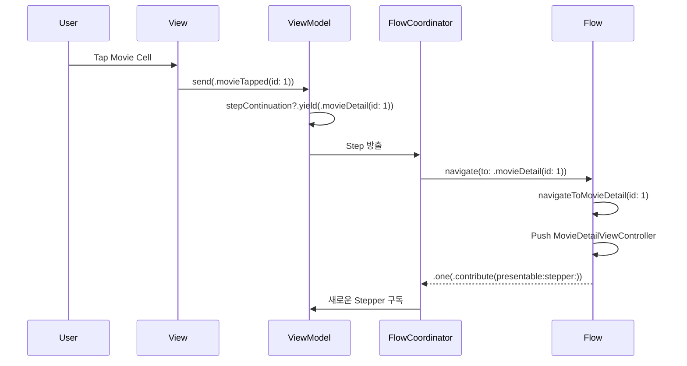

# AsyncFlow

Swift Concurrency 기반 iOS 네비게이션 프레임워크

[](https://swift.org)
[](https://developer.apple.com/ios/)
[](LICENSE)
[](https://github.com/Jimmy-Jung/AsyncFlow/actions/workflows/ci.yml)

## 개요

AsyncFlow는 [RxFlow](https://github.com/RxSwiftCommunity/RxFlow)에서 영감을 받아 Swift Concurrency로 재설계한 네비게이션 프레임워크입니다.

### RxFlow와의 차이점

| 특징 | RxFlow | AsyncFlow |
|------|--------|-----------|
| 비동기 처리 | RxSwift Observable | Swift Concurrency (async/await) |
| Step 스트림 | `PublishRelay<Step>` | `AsyncStream<Step>` |
| 스레드 안전성 | subscribeOn/observeOn | `@MainActor` |
| 외부 의존성 | RxSwift, RxRelay | 없음 (Swift 표준만 사용) |
| 메모리 관리 | DisposeBag | Task 자동 취소 |
| 프로젝트 관리 | CocoaPods/Carthage | Tuist |

### 주요 특징

- ✅ RxSwift 의존성 제거, Swift Concurrency만 사용
- ✅ [AsyncViewModel](https://github.com/Jimmy-Jung/AsyncViewModel)과 자연스러운 통합
- ✅ 선언적이고 테스트 가능한 네비게이션
- ✅ 타입 안전성 보장
- ✅ Deep Link, 권한 체크 등 고급 기능 지원
- ✅ Tuist 기반 프로젝트 관리

---

## 프로젝트 구조

```
AsyncFlow/
├── Tuist.swift                          # Tuist 전역 설정
├── Workspace.swift                      # Workspace 정의
├── Tuist/
│   ├── Package.swift                    # 외부 의존성 (AsyncViewModel)
│   └── ProjectDescriptionHelpers/
│       └── Project+Templates.swift      # 재사용 템플릿
│
├── Projects/
│   ├── AsyncFlow/                       # 🔥 AsyncFlow 라이브러리
│   │   ├── Project.swift
│   │   ├── Sources/
│   │   │   ├── Core/                    # 핵심 프로토콜
│   │   │   ├── Integration/             # 플랫폼 통합
│   │   │   ├── Utilities/               # 헬퍼
│   │   │   └── Testing/                 # 테스트 도구
│   │   └── Tests/
│   │
│   └── AsyncFlowExample/                # 📱 예제 앱
│       ├── Project.swift
│       ├── Sources/
│       │   ├── App/                     # 앱 진입점
│       │   ├── Models/                  # 데이터 모델
│       │   ├── Steps/                   # 네비게이션 Step
│       │   ├── Flows/                   # Flow 정의
│       │   ├── ViewModels/              # AsyncViewModel
│       │   └── Views/                   # UIViewController
│       └── Resources/
│
├── README.md                            # 프로젝트 소개
└── LICENSE                              # MIT 라이선스
```

---

## 설치

### Swift Package Manager

```swift
// Package.swift
dependencies: [
    .package(url: "https://github.com/Jimmy-Jung/AsyncFlow", from: "1.0.0")
]
```

### Tuist

```swift
// Tuist/Package.swift
dependencies: [
    .package(url: "https://github.com/Jimmy-Jung/AsyncFlow", from: "1.0.0")
]

// Project.swift
dependencies: [
    .external(name: "AsyncFlow")
]
```

> **Note**: 1.0.0 릴리스 전에는 특정 커밋이나 브랜치를 사용하세요:
> ```swift
> .package(url: "https://github.com/Jimmy-Jung/AsyncFlow", branch: "main")
> ```

---

## 핵심 개념

AsyncFlow는 6가지 핵심 타입으로 구성됩니다:

### 1. Step

네비게이션 의도를 표현하는 프로토콜

```swift
enum MovieStep: Step {
    case movieList
    case movieDetail(id: Int)
    case castDetail(id: Int)
    case unauthorized
}
```

### 2. Stepper

Step을 방출하는 주체 (주로 ViewModel)

```swift
@MainActor
final class MovieListViewModel: ObservableObject, Stepper {
    @StepEmitter var stepEmitter: StepEmitter<MovieStep>
    @Published var state = State()
    
    enum Input: Sendable {
        case movieTapped(id: Int)
    }
    
    struct State: Equatable, Sendable {
        var movies: [Movie] = []
    }
    
    func send(_ input: Input) {
        switch input {
        case let .movieTapped(id):
            emit(.movieDetail(id: id))  // ← Step 방출!
        }
    }
}
```

### 3. Presentable

화면에 표시될 수 있는 것 (UIViewController, Flow)

```swift
extension UIViewController: Presentable {}  // 자동 구현됨
```

### 4. Flow

네비게이션 영역 정의 및 Step → 네비게이션 액션 변환

```swift
final class MovieFlow: Flow {
    typealias StepType = MovieStep
    
    var root: any Presentable { navigationController }
    private let navigationController = UINavigationController()
    
    func navigate(to step: MovieStep) async -> FlowContributors<MovieStep> {
        switch step {
        case .movieList:
            return navigateToMovieList()
        case .movieDetail(let id):
            return navigateToMovieDetail(id: id)
        }
    }
    
    private func navigateToMovieList() -> FlowContributors<MovieStep> {
        let viewModel = MovieListViewModel()
        let viewController = MovieListViewController(viewModel: viewModel)
        navigationController.setViewControllers([viewController], animated: false)
        
        return .one(.contribute(presentable: viewController, stepper: viewModel))
    }
}
```

### 5. FlowContributor

다음 Stepper와 Presentable 연결

```swift
return .one(.contribute(presentable: viewController, stepper: viewModel))
return .multiple([
    .contribute(presentable: movieFlow, stepper: movieStepper),
    .contribute(presentable: watchedFlow, stepper: watchedStepper)
])
```

### 6. FlowCoordinator

전체 네비게이션 조율자

```swift
@main
class AppDelegate: UIResponder, UIApplicationDelegate {
    var window: UIWindow?
    let coordinator = FlowCoordinator()
    
    func application(
        _ application: UIApplication,
        didFinishLaunchingWithOptions launchOptions: [UIApplication.LaunchOptionsKey: Any]?
    ) -> Bool {
        window = UIWindow(frame: UIScreen.main.bounds)
        
        let appFlow = AppFlow(window: window!)
        let appStepper = OneStepper(MovieStep.appLaunch)
        coordinator.coordinate(flow: appFlow, with: appStepper)
        
        return true
    }
}
```

---

## 빌드 및 실행

### 1. Tuist 설치

```bash
curl -Ls https://install.tuist.io | bash
```

### 2. 프로젝트 생성

```bash
cd AsyncFlow
tuist install  # 외부 의존성 설치
tuist generate  # Xcode 프로젝트 생성
```

### 3. Xcode에서 실행

```bash
open AsyncFlow.xcworkspace
```

또는 Tuist로 직접 빌드:

```bash
tuist build AsyncFlowExample
tuist run AsyncFlowExample
```

---

## AsyncViewModel 통합

AsyncFlow는 AsyncViewModel과 자연스럽게 통합됩니다.

```swift
@AsyncViewModel
final class LoginViewModel: Stepper {
    typealias StepType = AuthStep
    
    func reduce(state: inout State, action: Action) -> [AsyncEffect<Action, CancelID>] {
        switch action {
        case .login(let email, let password):
            state.isLoading = true
            return [
                .run(id: .login) {
                    try await authService.login(email, password)
                    return .loginSuccess
                }
            ]
        case .loginSuccess:
            state.isLoading = false
            emit(.loginCompleted)  // ← Step 방출!
            return []
        }
    }
}
```

`Stepper` 프로토콜을 채택하면 `steps` 스트림과 `emit(_:)` 메서드가 자동으로 제공됩니다.

---

## 예제 앱

[AsyncFlowExample](Projects/AsyncFlowExample/) 프로젝트에서 실전 사용법을 확인할 수 있습니다.

### 데이터 흐름



---

## 테스트

### Flow 테스트

```swift
@Test
func testMovieFlowNavigation() async {
    let flow = MovieFlow()
    let store = FlowTestStore(flow: flow)
    
    let contributors = await store.navigate(to: .movieList)
    
    #expect(store.steps == [.movieList])
    
    if case .one(.contribute(let presentable, let stepper)) = contributors {
        #expect(presentable.viewController is MovieListViewController)
        #expect(stepper is MovieListViewModel)
    }
}
```

### Stepper 테스트

```swift
@Test
@MainActor
func testStepEmission() async throws {
    let mockStepper = MockStepper<MovieStep>()
    
    let collectionTask = Task {
        var steps: [MovieStep] = []
        for await step in mockStepper.steps {
            steps.append(step)
            if steps.count == 2 { break }
        }
        return steps
    }
    
    // 구독 시작 대기
    try await Task.sleep(nanoseconds: 10_000_000)
    
    mockStepper.emit(.movieList)
    mockStepper.emit(.movieDetail(id: 1))
    
    let receivedSteps = await collectionTask.value
    
    #expect(receivedSteps == [.movieList, .movieDetail(id: 1)])
}
```

---

## 문서

- [AsyncFlow Library](Projects/AsyncFlow/) - 라이브러리 코어
- [AsyncFlowExample](Projects/AsyncFlowExample/) - 예제 앱

---

## 요구사항

- iOS 15.0+
- macOS 12.0+
- Swift 6.0+
- Xcode 16.0+

---

## 라이선스

AsyncFlow는 MIT 라이선스로 배포됩니다. 자세한 내용은 [LICENSE](LICENSE) 파일을 참조하세요.

---

## 크레딧

AsyncFlow는 다음 프로젝트에서 영감을 받았습니다:

- [RxFlow](https://github.com/RxSwiftCommunity/RxFlow) - Reactive Flow Coordinator pattern
- [AsyncViewModel](https://github.com/Jimmy-Jung/AsyncViewModel) - 단방향 데이터 흐름
- [The Composable Architecture](https://github.com/pointfreeco/swift-composable-architecture) - Effect 패턴

---

**Made with ❤️ and ☕ in Seoul, Korea**
