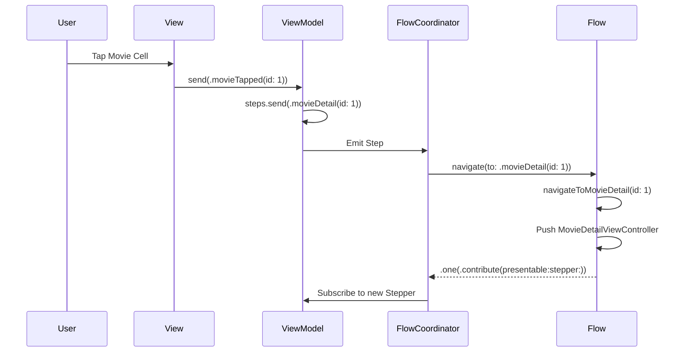

# AsyncFlow

<div align="center">

[](https://swift.org)
[](https://developer.apple.com)
[](LICENSE)
[](https://swift.org/package-manager/)

Declarative Navigation Framework based on Swift Concurrency

English | [한국어](README.md)

</div>

---

## Overview

AsyncFlow is a navigation framework completely redesigned with Swift Concurrency, inspired by [RxFlow](https://github.com/RxSwiftCommunity/RxFlow).

It provides declarative navigation management and Flow-based modular architecture for complex navigation logic.

### Features

- ✅ **Swift Concurrency Based**: Modern asynchronous processing using async/await and AsyncStream
- ✅ **Declarative Navigation**: Clear intent expression through Steps
- ✅ **Modularization**: Manage navigation areas separately by Flow
- ✅ **AsyncViewModel Friendly**: Natural integration with unidirectional data flow
- ✅ **DeepLink Support**: Handle deep links by injecting Steps externally
- ✅ **Testable**: Navigation logic testing support via FlowTestStore
- ✅ **Platform Neutral**: Support for both iOS and macOS

### Differences from RxFlow

| Feature | RxFlow | AsyncFlow |
|---------|--------|-----------|
| Async Processing | RxSwift Observable | Swift Concurrency (async/await) |
| Step Stream | PublishRelay<Step> | AsyncStream<Step> |
| Memory Management | DisposeBag | Automatic Task cleanup |
| Platform Support | iOS only | iOS, macOS |
| Dependencies | RxSwift, RxCocoa | None (Swift standard library only) |

---

## Table of Contents

- [Installation](#installation)
- [Core Concepts](#core-concepts)
  - [Step](#1-step)
  - [FlowStepper](#2-flowstepper)
  - [Presentable](#3-presentable)
  - [Flow](#4-flow)
  - [FlowContributor](#5-flowcontributor)
  - [FlowCoordinator](#6-flowcoordinator)
- [Quick Start](#quick-start)
- [Advanced Features](#advanced-features)
- [Example App](#example-app)
- [Testing](#testing)
- [Documentation](#documentation)
- [Requirements](#requirements)
- [License](#license)
- [Credits](#credits)

---

## Installation

### Swift Package Manager

AsyncFlow can be installed via Swift Package Manager.

Add the following to your `Package.swift` file:

```swift
dependencies: [
    .package(url: "https://github.com/Jimmy-Jung/AsyncFlow", from: "1.0.0")
]
```

Or in Xcode:

1. File > Add Package Dependencies...
2. Enter `https://github.com/Jimmy-Jung/AsyncFlow`
3. Select "Up to Next Major Version" and enter 1.0.0

### Tuist

For Tuist projects:

```swift
// Tuist/Package.swift
let packageSettings = PackageSettings(
    productTypes: [
        "AsyncFlow": .framework
    ]
)

// Project.swift
targets: [
    .target(
        name: "YourApp",
        dependencies: [
            .external(name: "AsyncFlow")
        ]
    )
]
```

---

## Core Concepts

AsyncFlow consists of 6 core types.

### 1. Step

A protocol that expresses navigation intent.

```swift
enum MovieStep: Step {
    case movieList
    case movieDetail(id: Int)
    case castDetail(id: Int)
    case unauthorized
}
```

Steps should be navigation-independent:

- ❌ `showMovieDetail(id: Int)` - Forces specific screen presentation
- ✅ `movieDetail(id: Int)` - Expresses intent only, Flow decides presentation

This allows the same Step to be presented differently depending on the Flow.
(e.g., SplitView on iPad, Push on iPhone)

### 2. FlowStepper

The subject that emits Steps (usually ViewModel).

```swift
@MainActor
final class MovieListViewModel: ObservableObject, FlowStepper {
    @Steps var steps
    
    @Published var state = State()
    
    enum Input: Sendable {
        case movieTapped(id: Int)
    }
    
    struct State: Equatable, Sendable {
        var movies: [Movie] = []
    }
    
    func send(_ input: Input) {
        switch input {
        case let .movieTapped(id):
            steps.send(MovieStep.movieDetail(id: id))  // ← Emit Step!
        }
    }
}
```

### 3. Presentable

A protocol that abstracts what can be displayed on screen.

```swift
// UIViewController automatically implements Presentable
extension UIViewController: Presentable {}

// Flow is also Presentable
protocol Flow: AnyObject, Presentable {
    var root: Presentable { get }
    func navigate(to step: Step) -> FlowContributors
}
```

### 4. Flow

Defines navigation area and converts Step → Navigation action.

```swift
final class MovieFlow: Flow {
    // MARK: - Properties
    
    var root: Presentable { navigationController }
    private let navigationController = UINavigationController()
    
    // MARK: - Flow Protocol
    
    func navigate(to step: Step) -> FlowContributors {
        guard let step = step as? MovieStep else { return .none }
        
        switch step {
        case .movieList:
            return navigateToMovieList()
        case .movieDetail(let id):
            return navigateToMovieDetail(id: id)
        case .castDetail(let id):
            return navigateToCastDetail(id: id)
        case .unauthorized:
            return showUnauthorizedAlert()
        }
    }
    
    // MARK: - Navigation Methods
    
    private func navigateToMovieList() -> FlowContributors {
        let viewModel = MovieListViewModel()
        let viewController = MovieListViewController(viewModel: viewModel)
        navigationController.setViewControllers([viewController], animated: false)
        
        return .one(flowContributor: .contribute(
            withNextPresentable: viewController,
            withNextStepper: viewModel
        ))
    }
    
    private func navigateToMovieDetail(id: Int) -> FlowContributors {
        let viewModel = MovieDetailViewModel(movieId: id)
        let viewController = MovieDetailViewController(viewModel: viewModel)
        navigationController.pushViewController(viewController, animated: true)
        
        return .one(flowContributor: .contribute(
            withNextPresentable: viewController,
            withNextStepper: viewModel
        ))
    }
}
```

### 5. FlowContributor

Connects the next Stepper and Presentable.

```swift
// Single Contributor
return .one(flowContributor: .contribute(
    withNextPresentable: viewController,
    withNextStepper: viewModel
))

// Multiple Contributors (e.g., TabBar)
return .multiple(
    .contribute(withNextPresentable: movieFlow, withNextStepper: movieStepper),
    .contribute(withNextPresentable: watchedFlow, withNextStepper: watchedStepper)
)

// Forward Step to current Flow
return .one(flowContributor: .forwardToCurrentFlow(withStep: MovieStep.home))

// Forward Step to parent Flow
return .one(flowContributor: .forwardToParentFlow(withStep: AppStep.logout))

// End Flow and forward Step to parent
return .end(forwardToParentFlowWithStep: AppStep.onboardingComplete)
```

### 6. FlowCoordinator

The coordinator that orchestrates all navigation.

```swift
@main
class AppDelegate: UIResponder, UIApplicationDelegate {
    var window: UIWindow?
    let coordinator = FlowCoordinator()
    
    func application(
        _ application: UIApplication,
        didFinishLaunchingWithOptions launchOptions: [UIApplication.LaunchOptionsKey: Any]?
    ) -> Bool {
        window = UIWindow(frame: UIScreen.main.bounds)
        
        let appFlow = AppFlow(window: window!)
        let appStepper = OneStepper(withSingleStep: MovieStep.movieList)
        
        // Subscribe to navigation events (optional)
        Task {
            for await event in coordinator.didNavigate {
                print("Navigation completed: \(event)")
            }
        }
        
        coordinator.coordinate(flow: appFlow, with: appStepper)
        
        return true
    }
}
```

---

## Quick Start

### Step 1: Define Step

```swift
enum AppStep: Step {
    case launch
    case login
    case home
}
```

### Step 2: Implement Flow

```swift
final class AppFlow: Flow {
    var root: Presentable { window }
    private let window: UIWindow
    
    init(window: UIWindow) {
        self.window = window
    }
    
    func navigate(to step: Step) -> FlowContributors {
        guard let step = step as? AppStep else { return .none }
        
        switch step {
        case .launch:
            return navigateToLogin()
        case .login:
            return navigateToLogin()
        case .home:
            return navigateToHome()
        }
    }
    
    private func navigateToLogin() -> FlowContributors {
        let viewModel = LoginViewModel()
        let viewController = LoginViewController(viewModel: viewModel)
        window.rootViewController = viewController
        window.makeKeyAndVisible()
        
        return .one(flowContributor: .contribute(
            withNextPresentable: viewController,
            withNextStepper: viewModel
        ))
    }
    
    private func navigateToHome() -> FlowContributors {
        let viewModel = HomeViewModel()
        let viewController = HomeViewController(viewModel: viewModel)
        window.rootViewController = viewController
        
        return .one(flowContributor: .contribute(
            withNextPresentable: viewController,
            withNextStepper: viewModel
        ))
    }
}
```

### Step 3: Emit Step from ViewModel

```swift
@MainActor
final class LoginViewModel: ObservableObject, FlowStepper {
    @Steps var steps
    @Published var state = State()
    
    struct State: Equatable, Sendable {
        var email: String = ""
        var password: String = ""
        var isLoading: Bool = false
    }
    
    func login() async {
        state.isLoading = true
        
        // Login logic...
        
        state.isLoading = false
        steps.send(AppStep.home)  // Navigate to home
    }
}
```

### Step 4: Start FlowCoordinator

```swift
let coordinator = FlowCoordinator()
let appFlow = AppFlow(window: window)
let appStepper = OneStepper(withSingleStep: AppStep.launch)

coordinator.coordinate(flow: appFlow, with: appStepper)
```

---

## Advanced Features

### Step Adaptation

Implement logic for permission checks, login verification, etc.

```swift
func adapt(step: Step) async -> Step {
    guard let movieStep = step as? MovieStep else { return step }
    
    switch movieStep {
    case .movieDetail:
        // Permission check
        if await PermissionManager.isAuthorized() {
            return step
        } else {
            return MovieStep.unauthorized
        }
    default:
        return step
    }
}
```

### DeepLink Handling

Handle deep links by injecting Steps externally.

```swift
// Create Step from URL scheme
func handleDeepLink(_ url: URL) {
    guard let components = URLComponents(url: url, resolvingAgainstBaseURL: false),
          let movieId = components.queryItems?.first(where: { $0.name == "id" })?.value,
          let id = Int(movieId) else { return }
    
    // Inject Step into FlowCoordinator
    coordinator.navigate(to: MovieStep.movieDetail(id: id))
}
```

### AsyncViewModel Integration

AsyncFlow integrates naturally with [AsyncViewModel](https://github.com/Jimmy-Jung/AsyncViewModel).

```swift
@AsyncViewModel
final class LoginViewModel: FlowStepper {
    @Steps var steps
    
    enum Input: Equatable, Sendable {
        case login(email: String, password: String)
    }
    
    enum Action: Equatable, Sendable {
        case login(email: String, password: String)
        case loginSuccess
        case loginFailure(String)
    }
    
    struct State: Equatable, Sendable {
        var email: String = ""
        var password: String = ""
        var isLoading: Bool = false
        var errorMessage: String?
    }
    
    enum CancelID: Hashable, Sendable {
        case login
    }
    
    func transform(_ input: Input) -> [Action] {
        switch input {
        case let .login(email, password):
            return [.login(email: email, password: password)]
        }
    }
    
    func reduce(state: inout State, action: Action) -> [AsyncEffect<Action, CancelID>] {
        switch action {
        case let .login(email, password):
            state.isLoading = true
            state.errorMessage = nil
            return [
                .run(id: .login) {
                    try await authService.login(email: email, password: password)
                    return .loginSuccess
                } catch: { error in
                    return .loginFailure(error.localizedDescription)
                }
            ]
            
        case .loginSuccess:
            state.isLoading = false
            steps.send(AppStep.home)  // ← Emit Step!
            return []
            
        case let .loginFailure(message):
            state.isLoading = false
            state.errorMessage = message
            return []
        }
    }
    
    func handleError(_ error: SendableError) {
        print("Error: \(error.localizedDescription)")
    }
}
```

When adopting the FlowStepper protocol, you can use the `@Steps` property wrapper to automatically generate the `steps` Subject.

### Starting Child Flow

A Flow can start another Flow as a child.

```swift
private func startMovieFlow() -> FlowContributors {
    let movieFlow = MovieFlow()
    let movieStepper = OneStepper(withSingleStep: MovieStep.movieList)
    
    // movieFlow is both Presentable and Flow
    return .one(flowContributor: .contribute(
        withNextPresentable: movieFlow,
        withNextStepper: movieStepper
    ))
}
```

### CompositeStepper

Multiple FlowSteppers can be composed.

```swift
let stepper1 = OneStepper(withSingleStep: AppStep.launch)
let stepper2 = someViewModel // FlowStepper implementation

let compositeStepper = CompositeStepper(steppers: [stepper1, stepper2])

coordinator.coordinate(flow: appFlow, with: compositeStepper)
```

---

## Example App

Check out practical usage in the AsyncFlowExample project.

### Key Features

- ✅ Screen-to-screen navigation (A → B → C → D → E)
- ✅ N-step back navigation (1-step, 2-step, 3-step)
- ✅ Jump to specific screen (A → E)
- ✅ DeepLink simulation
- ✅ NavigationStack visualization (SwiftUI)

### How to Run

1. Install Tuist

```bash
curl -Ls https://install.tuist.io | bash
```

2. Generate and run project

```bash
cd AsyncFlow
tuist install
tuist generate
open AsyncFlow.xcworkspace
```

Or run directly with Tuist:

```bash
tuist run AsyncFlowExample
```

### Data Flow



---

## Testing

AsyncFlow makes it easy to test navigation logic via FlowTestStore.

### Flow Testing

```swift
import Testing
import AsyncFlow
@testable import YourApp

@Test
@MainActor
func testMovieFlowNavigation() async {
    // Given
    let flow = MovieFlow()
    let store = FlowTestStore(flow: flow)
    
    // When
    let contributors = store.navigate(to: MovieStep.movieList)
    
    // Then
    #expect(store.steps == [MovieStep.movieList])
    
    if case .one(.contribute(let presentable, let stepper, _, _)) = contributors {
        #expect(presentable.viewController is MovieListViewController)
        #expect(stepper is MovieListViewModel)
    }
}
```

### Stepper Testing

```swift
@Test
@MainActor
func testStepEmission() async throws {
    // Given
    let mockStepper = MockStepper()
    
    let collectionTask = Task {
        var steps: [Step] = []
        for await step in mockStepper.steps.stream {
            steps.append(step)
            if steps.count == 2 { break }
        }
        return steps
    }
    
    // Wait for subscription to start
    try await Task.sleep(nanoseconds: 10_000_000)
    
    // When
    mockStepper.emit(MovieStep.movieList)
    mockStepper.emit(MovieStep.movieDetail(id: 1))
    
    let receivedSteps = await collectionTask.value
    
    // Then
    #expect(receivedSteps.count == 2)
}
```

### Running Tests

```bash
# Run in Xcode
Command + U

# Command line
tuist test AsyncFlow
```

---

## Documentation

- [API Reference](https://jimmy-jung.github.io/AsyncFlow/documentation/asyncflow/) (DocC)
- [Migration Guide](Docs/MIGRATION.md) (RxFlow → AsyncFlow)
- [Architecture Guide](Docs/ARCHITECTURE.md)
- [FAQ](Docs/FAQ.md)

---

## Requirements

- iOS 15.0+ / macOS 12.0+
- Swift 6.0+
- Xcode 16.0+

---

## Roadmap

- [ ] visionOS support
- [ ] watchOS support
- [ ] Navigation debugging tools
- [ ] Coordinator communication API
- [ ] Flow animation customization

---

## Contributing

Contributions are always welcome!

1. Fork the Project
2. Create your Feature Branch (`git checkout -b feature/AmazingFeature`)
3. Commit your Changes (`git commit -m 'Add some AmazingFeature'`)
4. Push to the Branch (`git push origin feature/AmazingFeature`)
5. Open a Pull Request

See [CONTRIBUTING.md](CONTRIBUTING.md) for details.

---

## License

AsyncFlow is distributed under the MIT license. See [LICENSE](LICENSE) for details.

---

## Credits

AsyncFlow was inspired by:

- [RxFlow](https://github.com/RxSwiftCommunity/RxFlow) - Reactive Flow Coordinator pattern
- [AsyncViewModel](https://github.com/Jimmy-Jung/AsyncViewModel) - Unidirectional data flow
- [The Composable Architecture](https://github.com/pointfreeco/swift-composable-architecture) - Effect pattern

---

## Community

- Have questions or suggestions? Leave them in [GitHub Issues](https://github.com/Jimmy-Jung/AsyncFlow/issues).
- Found a bug? Create a [Bug Report](https://github.com/Jimmy-Jung/AsyncFlow/issues/new?template=bug_report.md).
- Want to suggest a new feature? Create a [Feature Request](https://github.com/Jimmy-Jung/AsyncFlow/issues/new?template=feature_request.md).

---

<div align="center">

Made with ❤️ and ☕ in Seoul, Korea

[⬆ Back to Top](#asyncflow)

</div>

